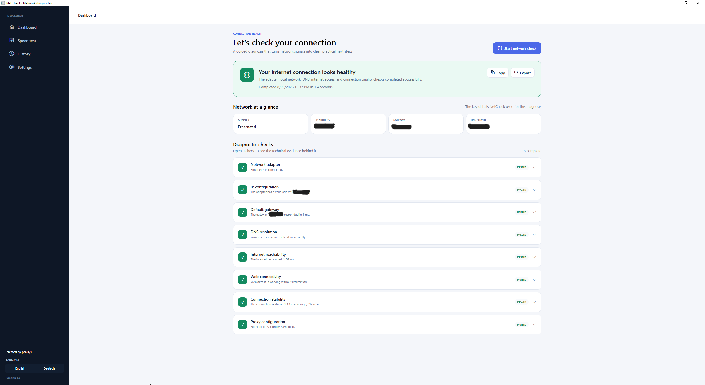

# NetCheck

NetCheck is a native Windows desktop application that explains *why* a computer has no internet access, limited connectivity, or an unstable connection. It performs a read-only assessment, correlates the evidence, presents a plain-language diagnosis, and can apply an explicitly approved repair plan for supported Windows configuration problems.



## What it checks

| Stage | What NetCheck determines |
|---|---|
| Network adapter | Whether Windows sees an active Ethernet or Wi-Fi link |
| IP configuration | Whether the adapter has a usable address or a DHCP/APIPA problem |
| Default gateway | Whether a route exists and the local router responds |
| DNS resolution | Whether a known hostname resolves through the configured DNS service |
| Internet reachability | Whether public IP addresses are directly reachable |
| Web connectivity | Whether HTTP access works or a captive/sign-in portal intercepts it |
| Connection stability | Short-sample packet loss, average latency, and jitter |
| Proxy configuration | Whether a user proxy may explain a failed web check |

The separate, manually started speed test measures latency plus average and maximum observed download and upload throughput over an approximately 30-second measurement. Completed results are stored locally alongside diagnostics and configuration changes in the unified history.

The diagnosis engine correlates results instead of treating every failed ping as an internet outage. For example, it can distinguish a DNS failure from a gateway failure, and it uses the web check to avoid classifying an ICMP-blocking network as completely offline.

## User experience

- Friendly, modern WPF dashboard with live progress and cancellation
- Complete, switchable English or German interface and diagnostic presentation
- Plain-language overall diagnosis and prioritized next steps
- Evidence-based repair plans with per-step results and restart guidance
- Expandable technical evidence for every check
- Unified local history for diagnoses, speed tests, settings changes, and language switches
- Privacy-aware HTML, JSON, and text export
- Configurable endpoints, timeouts, sample count, and quality thresholds
- Opt-in, approximately 30-second internet speed test with live progress, cancellation, maximum/average Mbit/s results, and local history
- Diagnostics run without elevation; repairs are never automatic and may request UAC after confirmation
- Keyboard navigation, high-contrast status text, and automation labels

## Requirements

- A Microsoft-supported x64 Windows release: Windows 11, or a supported Windows 10 LTSC/Enterprise edition
- Git and an internet connection for the first build

No administrator rights, Visual Studio installation, or existing .NET SDK is required. The build launcher downloads the official .NET 10 SDK into the ignored `.dotnet` directory when a compatible, complete SDK is not already available. NuGet packages are restored automatically.

Release builds are self-contained; end users do not need to install .NET. The application manifest and target platform retain Windows build 17763 as the technical minimum, but production use should remain on an operating-system release supported by Microsoft.

## Build and run

Clone the repository and run the checked-in launcher from Command Prompt or PowerShell:

```console
git clone https://github.com/pcalsys/NetCheck.git
cd NetCheck
build.cmd
```

This single command restores dependencies, builds all projects in Release mode, runs all tests, and creates the self-contained Windows x64 application. It also bypasses a restrictive local PowerShell execution policy only for the checked-in build script.

On a computer without a compatible .NET SDK, the first build downloads the official SDK into `.dotnet` and shows live progress from 0% to 100% in the command window before extraction begins.

After a successful local Release build, a start-ready copy is also placed in the current user's Windows Downloads folder under `NetCheck-1.1.0\NetCheck.exe`. The command window prints the complete path in a prominent completion message, and File Explorer opens the containing folder. Continuous-integration builds do not create or open this personal Downloads copy.

The finished files are:

- `artifacts\publish\win-x64\NetCheck.exe` — directly runnable application
- `artifacts\NetCheck-1.1.0-win-x64.zip` — distributable package
- `artifacts\NetCheck-1.1.0-win-x64.zip.sha256` — SHA-256 checksum

Start the locally built application with:

```console
artifacts\publish\win-x64\NetCheck.exe
```

Useful developer options:

```console
build.cmd -SkipTests
build.cmd -SkipPublish
build.cmd -SkipDownloadsCopy
build.cmd -CollectCoverage
```

`-SkipTests` and `-SkipPublish` shorten local iteration. `-SkipDownloadsCopy` keeps the start-ready files only under `artifacts`. The default `build.cmd` path is the supported clean-clone and release build and is exercised by GitHub Actions on every push and pull request.

## Privacy and data

NetCheck sends only the traffic required by its configured checks: DNS lookup, ICMP echo requests, and one lightweight HTTP connectivity request. The defaults are visible and editable in Settings.

The speed test runs only when the user starts it. It spreads five download rounds across 17 seconds and four upload rounds across 11 seconds, plus latency and preparation, for a total of roughly 30 seconds. Dynamically sized test data goes directly to and from Cloudflare's `speed.cloudflare.com` endpoints, with a hard combined cap of about 200 MB per run; slower connections usually use less. NetCheck stores the result only in its local history and does not upload it as NetCheck telemetry. Cloudflare receives the connection IP address as the speed-test endpoint operator. Wi-Fi conditions, VPNs, other traffic, the selected test endpoint, and provider congestion can all affect the measurement.

The Fix workflow runs only after confirmation. It may renew DHCP, clear DNS or ARP caches, disable an identified current-user proxy, or reset Windows network components. NetCheck does not attempt to change physical connectivity, managed static addressing, captive portals, Wi-Fi signal quality, router configuration, or provider infrastructure.

Local files are stored in `%LOCALAPPDATA%\NetCheck`:

- `Reports\` — completed diagnostic history
- `Activities\` — speed-test results and configuration-change history
- `settings.json` — user preferences
- `NetCheck.log` — created only when an application error is recorded

Computer names are excluded from exports by default. Adapter MAC addresses are always redacted from exported reports. NetCheck does not upload reports or telemetry.

See the [changelog](CHANGELOG.md), [architecture](docs/ARCHITECTURE.md), [security and privacy](SECURITY.md), and [support guide](docs/SUPPORT.md) for details.

## Repository structure

```text
src/
  NetCheck.Core/             Domain models, interfaces, engine, diagnosis rules
  NetCheck.Infrastructure/   Windows probes, storage, export, logging
  NetCheck.App/              WPF application and MVVM presentation
tests/
  NetCheck.Core.Tests/
  NetCheck.Infrastructure.Tests/
scripts/
  dotnet.ps1
  build.ps1
  publish.ps1
build.cmd
```
